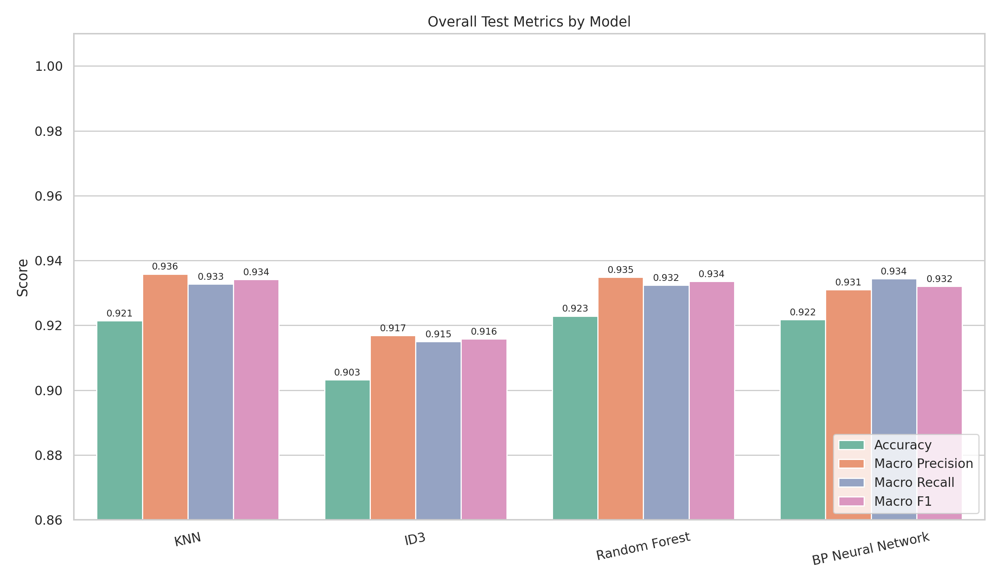

下面这版 README 按你老师要求写成了适合 GitHub 展示的格式，内容结合了你报告里的数据处理、算法实现、精度对比、推理速度、鲁棒性和过拟合分析等章节整理。你的报告中已说明数据清洗、特征工程、特征选择、多算法实现和实验对比流程，可作为 README 的依据。

# Dry Bean 多分类算法实验系统

本项目基于 Dry Bean Dataset 干豆数据集，实现了一个面向多分类任务的机器学习实验系统。项目围绕数据清洗、特征工程、特征选择、模型训练、模型评估和算法对比分析展开，手写实现并比较了 KNN、ID3 决策树、随机森林和 BP 神经网络等多种分类算法。

本项目不依赖图形化 UI，所有算法训练、测试和实验分析均通过命令行统一调用，便于复现实验结果和在 GitHub 上展示完整工程结构。

---

## 一、项目简介

本实验任务是根据干豆样本的形态学特征，对样本进行七分类识别。数据集中的类别包括：

* BARBUNYA
* BOMBAY
* CALI
* DERMASON
* HOROZ
* SEKER
* SIRA

实验过程中，项目首先对原始数据中存在的缺失值、非法字符、异常值、单位混入、标签格式不统一等问题进行清洗；随后进行特征工程和特征筛选；最后分别使用多种分类算法完成训练与测试，并从准确率、混淆矩阵、推理速度、鲁棒性和过拟合情况等角度进行综合比较。

---

## 二、目录结构

```text
last_work/
|-- main.py
|-- drybean_cli.py
|-- config.py
|-- requirements.txt
|-- data/
|-- models/
|-- experiments/
|-- utils/
|-- DryBeanDataset/
```

其中：

* `main.py`：项目统一入口文件，用于通过命令行调用不同实验任务
* `drybean_cli.py`：命令行参数解析与任务分发模块
* `config.py`：统一管理数据路径、输出路径和默认实验参数
* `requirements.txt`：项目运行所需依赖
* `data/`：数据清洗、预处理、特征工程和特征筛选
* `models/`：KNN、ID3、随机森林和 BP 神经网络等模型实现
* `experiments/`：训练评估、算法对比、推理速度、鲁棒性和过拟合分析
* `utils/`：评价指标、绘图、结果保存等通用工具
* `DryBeanDataset/`：数据集文件及各类实验结果输出

---

## 三、数据处理流程

### 1. 数据清洗

原始数据中存在多种数据质量问题，包括缺失值、非法字符、单位混入、异常数值和标签噪声等。项目首先对类别标签进行统一处理，包括去除首尾空格、统一大小写，并修正类似 `S3K3R`、`H0R0Z` 等数字替代字母的错误标签，使类别统一为七个标准类别。

对于数值特征，项目将空字符串、`?`、`NA` 等异常标记识别为缺失值，并将混入单位的字段转换为纯数值形式。同时对异常值进行修正，例如将负面积转换为绝对值，将明显不合理的数值标记为缺失值，并使用训练集统计量进行中位数填充，避免验证集和测试集信息泄漏。

### 2. 特征工程

在清洗后的基础特征上，项目进一步构造了多类衍生特征，包括轴长比例、面积与周长关系、凸包差异、椭圆近似、形状交互和对数变换等特征。通过特征工程，原始 16 个数值特征被扩展为 41 个特征，从而增强了对干豆形状和轮廓信息的表达能力。

### 3. 特征选择

为了减少特征冗余并提高模型训练效率，项目使用 Pearson 相关系数进行特征筛选。当两个特征高度相关时，仅保留其中一个代表性特征。经过相关性筛选后，特征数量由 41 个减少到 16 个，既保留了重要形态特征，又降低了模型计算复杂度。

---

## 四、算法实现

### 1. KNN 分类器

KNN 算法采用手写方式实现。该模型不进行显式参数训练，而是将训练集样本作为样本库保存下来。预测时，模型计算待预测样本与所有训练样本之间的平方欧氏距离，选取距离最近的 K 个样本，并通过多数投票确定最终类别。

项目中使用平方欧氏距离代替普通欧氏距离，因为 KNN 只关心距离排序，是否开平方不会改变近邻顺序，同时可以减少计算量。在投票阶段，如果多个类别票数相同，则优先选择近邻距离总和更小的类别，使距离更近的样本对分类结果具有更大影响。

### 2. ID3 决策树

ID3 决策树基于信息熵和信息增益构建。模型在每个节点计算不同特征划分后带来的信息增益，并选择信息增益最大的特征和阈值作为当前节点的划分依据。

由于本实验数据主要为连续数值型特征，因此项目在 ID3 思想基础上加入了连续特征阈值二分策略。模型会尝试不同划分阈值，将样本划分为左右子集，并递归构建左右子树。为了控制树的复杂度，代码中加入了最大深度、最小分裂样本数、最小叶子节点样本数和最小信息增益等限制条件。

### 3. 随机森林

随机森林是在多棵决策树基础上的集成学习模型。项目通过 Bootstrap 有放回抽样和随机特征子集选择，构建多棵差异化决策树。预测时，每棵树都会给出一个分类结果，最终通过多数投票得到随机森林的预测类别。

与单棵 ID3 决策树相比，随机森林能够降低单棵树对训练数据细节的依赖，缓解过拟合问题，提高模型泛化稳定性。但由于需要训练和预测多棵树，其训练和推理开销也相对更高。

### 4. BP 神经网络

BP 神经网络采用“输入层—隐藏层—输出层”的单隐藏层结构。输入层接收标准化后的特征，隐藏层使用 ReLU 激活函数提取非线性特征，输出层通过 Softmax 输出各类别概率。

模型训练过程包括前向传播、交叉熵损失计算、误差反向传播和随机梯度下降参数更新。代码中同时加入了类别加权、L2 正则化、Dropout 和早停策略，以提高模型泛化能力并降低过拟合风险。

---

## 五、统一命令行调用

项目通过 `main.py` 提供统一入口，可以在命令行中调用不同实验任务。

### 1. 运行完整实验

```bash
python main.py all
```

### 2. 单独训练并测试某个模型

```bash
python main.py train --model knn
python main.py train --model id3
python main.py train --model random_forest
python main.py train --model bp
```

### 3. 运行推理速度测试

```bash
python main.py speed
```

### 4. 运行鲁棒性分析

```bash
python main.py robustness --noise-intensities 0.30,0.50
```

可选噪声类型包括：

* `gaussian`：高斯噪声
* `uniform`：均匀噪声
* `feature_dropout`：特征随机丢失
* `label_flip`：标签翻转

### 5. 运行过拟合与参数影响分析

```bash
python main.py overfitting
```

### 6. 运行样本规模适应性分析

```bash
python main.py sample-size
```

---

## 六、实验结果与分析

### 1. 测试集精度对比

项目统计了各模型在测试集上的 Accuracy、Macro Precision、Macro Recall 和 Macro F1 指标，用于比较不同算法的整体分类性能。

| 模型                | Accuracy | Macro Precision | Macro Recall | Macro F1 |
| ----------------- | -------: | --------------: | -----------: | -------: |
| KNN               |    0.921 |           0.936 |        0.933 |    0.934 |
| ID3               |    0.903 |           0.917 |        0.915 |    0.916 |
| Random Forest     |    0.923 |           0.935 |        0.932 |    0.934 |
| BP Neural Network |    0.922 |           0.931 |        0.934 |    0.932 |

从整体指标来看，KNN、随机森林和 BP 神经网络的分类效果较为接近，整体优于 ID3 决策树。其中，随机森林的测试集准确率最高，约为 0.923；BP 神经网络和 KNN 分别达到 0.922 和 0.921，三者差距较小。从 Macro F1 指标看，KNN、随机森林和 BP 神经网络均保持在 0.93 以上，说明它们不仅整体准确率较高，而且对各类别的分类效果较均衡。ID3 决策树的 Accuracy 和 Macro F1 相对较低，说明单棵决策树在复杂类别边界上的泛化能力略弱。



### 2. BP 神经网络 Loss 曲线

由于 BP 神经网络属于基于梯度优化的模型，其参数需要通过前向传播、损失计算、反向传播和梯度下降不断迭代更新，因此项目绘制了训练集 loss 和验证集 loss 随 epoch 变化的曲线。

实验结果表明，BP 神经网络在训练初期 loss 下降较快，随后逐渐进入较低区间并小幅波动，说明模型基本收敛。曲线中的最佳 epoch 体现了早停策略的作用，即模型会保存验证集表现最优的参数，而不是简单使用最后一轮参数。训练集和验证集 loss 没有明显分离，也说明 Dropout 和 L2 正则化在一定程度上降低了过拟合风险。

### 3. 推理速度对比

项目进一步统计了各模型在完整测试集上的总推理时间。推理时间指的是模型训练完成后，对测试集样本完成预测所消耗的时间，不包括数据清洗、模型训练、保存结果和绘图等过程。

| 模型                | 完整测试集推理时间 | 推理特点                 |
| ----------------- | --------: | -------------------- |
| KNN               | 62.5635 s | 预测时需要遍历训练集并计算距离，推理最慢 |
| ID3               |  0.0048 s | 单棵树沿路径判断，推理最快        |
| Random Forest     |  0.2224 s | 多棵树分别预测后投票，速度中等      |
| BP Neural Network |  0.2212 s | 只需一次前向传播，推理效率较高      |

从推理时间来看，ID3 决策树速度最快，因为单棵决策树预测时只需要沿着树结构进行少量条件判断。BP 神经网络和随机森林的推理时间较为接近，均在 0.22 s 左右，其中 BP 神经网络预测时只需进行一次前向传播，随机森林则需要多棵树分别预测后再投票。KNN 的推理时间明显最长，达到 62.5635 s，这是因为 KNN 在预测每个测试样本时都需要与训练集中所有样本计算距离，因此当训练集规模较大时，推理成本会显著增加。


### 4. 鲁棒性分析

为了比较模型对噪声数据的适应能力，项目在训练集中加入不同类型和不同强度的噪声，并使用干净测试集进行统一评估。实验通过比较噪声训练后测试准确率相对于干净训练结果的下降幅度，判断模型鲁棒性。

结果表明，高斯噪声和均匀噪声对各模型影响较小，说明标准化后的干豆特征对一般连续数值扰动不太敏感。特征丢失噪声会对部分模型造成一定影响，其中 BP 神经网络在高比例特征丢失下下降较明显。标签翻转噪声影响最大，ID3 对标签噪声最敏感，KNN 次之；随机森林和 BP 神经网络整体更稳定，其中 BP 神经网络在标签噪声下表现出较强鲁棒性。

### 5. 过拟合与参数影响分析

项目通过改变模型关键参数，比较训练集、验证集和测试集准确率变化，分析模型是否存在过拟合。

KNN 中，K 值对过拟合影响明显。当 K=1 时，模型几乎记忆训练集，训练准确率远高于验证集和测试集；随着 K 增大，三条曲线逐渐接近，过拟合风险降低。

ID3 中，最大树深是影响过拟合的关键参数。随着树深增加，训练准确率持续上升，但验证集和测试集准确率不再明显提升，说明模型开始拟合训练集细节。

随机森林相比 ID3 更稳定，但仍然受到树深影响。由于其采用多树集成和随机特征选择，过拟合程度低于单棵决策树。

BP 神经网络在 epoch 增加时训练、验证和测试准确率整体接近，没有出现明显分离，说明 Dropout、L2 正则化和早停策略有效控制了过拟合。

---

## 七、输出结果

实验运行后，结果会保存到 `DryBeanDataset/` 下的不同目录中，例如：

```text
DryBeanDataset/
|-- bp_nn_results/
|-- knn_results/
|-- tree_model_results/
|-- inference_speed_results/
|-- robustness_results/
|-- overfitting_analysis_results/
|-- visualizations/
```

主要输出包括：

* 各模型测试集预测结果
* 各模型评价指标报告
* 混淆矩阵
* BP 神经网络 loss 曲线
* 推理速度对比图
* 鲁棒性对比图
* 过拟合分析图
* 样本规模适应性分析图

---

## 八、项目特点

本项目具有以下特点：

1. 对原始数据进行了完整的数据清洗和预处理，处理了缺失值、异常值、非法字符、标签噪声等问题。
2. 通过特征工程扩展形态学特征，并通过相关性筛选降低特征冗余。
3. 手写实现 KNN、ID3 决策树、随机森林和 BP 神经网络等多种分类算法。
4. 使用统一命令行入口调用不同模型和实验任务，避免分散脚本难以管理的问题。
5. 从准确率、混淆矩阵、推理速度、鲁棒性和过拟合等多个角度进行综合评价。
6. 所有实验结果均保存为文件和图像，便于复现实验和论文展示。

---

## 九、运行环境

建议使用 Python 3.10 或以上版本。

安装依赖：

```bash
pip install -r requirements.txt
```

常用依赖包括：

```text
numpy
pandas
matplotlib
```

如果项目中使用了额外绘图或表格处理库，也可在 `requirements.txt` 中补充。

---

## 十、总结

本项目围绕 Dry Bean 多分类任务，构建了一个较完整的机器学习实验系统。实验不仅实现了多种分类算法，还从数据处理、算法实现、精度表现、推理效率、鲁棒性和过拟合情况等方面进行了系统分析。

综合实验结果来看，随机森林、BP 神经网络和 KNN 在测试集上表现较好，其中随机森林和 BP 神经网络在稳定性和泛化能力方面更具优势；ID3 决策树虽然整体精度略低，但结构简单、推理速度快、可解释性较强；KNN 实现简单但推理开销较大。通过多角度对比可以看出，不同算法各有适用场景，实际应用中应根据准确率、速度、鲁棒性和可解释性等需求综合选择模型。
